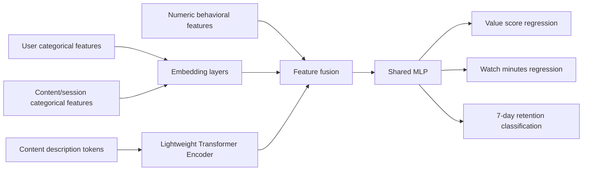

# Project Report: Value-Based User Modeling for OTT Platforms

## Research Question

Can we estimate the value a user derives from an OTT session using content metadata, user history, and interaction context, then jointly predict engagement and retention?

This is intentionally framed as a platform research problem rather than a generic prediction task. A recruiter should see that the project connects modeling choices to OTT business questions: satisfaction, return probability, content value, and product surface quality.

## Dataset Design

The dataset is synthetic and reproducible. It contains three linked tables:

- `users.csv`: region, subscription tier, age bucket, weekly sessions, completion history, and price sensitivity.
- `content.csv`: genre, language, quality, popularity, duration, title, and text description.
- `interactions.csv`: user-content session events, entry surface, device, completion, watch minutes, perceived value, and 7-day retention.

The target construction encodes reasonable OTT assumptions:

- Higher content quality and better completion increase perceived value.
- Premium users have lower friction and slightly higher value.
- Search and continue-watching sessions tend to indicate stronger intent.
- Retention depends on value, activity habit, completion, and subscription context.

## Model Architecture

The PyTorch model is multi-input and multi-task:

This is stronger than a plain tabular baseline because it demonstrates how content metadata text can enter a user modeling system without requiring a heavyweight LLM.

## Evaluation Plan

Primary metrics:

- Value score: RMSE.
- Watch minutes: MAE.
- Retention: accuracy and ROC-AUC.
- Segment diagnostics: value MAE by subscription tier and genre.
- Product artifact: value-aware candidate ranking for content surfacing.

Useful ablations:

- Remove content text encoder.
- Remove interaction context.
- Single-task heads versus multi-task learning.
- Replace transformer text encoder with mean-pooled token embeddings.
- Compare neural model against `baselines.py` gradient-boosted tabular models.

## Experiment Assets Added

- `src/value_modeling/baselines.py` trains strong tabular baselines so the neural model is not evaluated in isolation.
- `src/value_modeling/experiments.py` creates a quick reproducible suite for reviewers.
- `src/value_modeling/recommend.py` converts value, retention, completion, and watch time into a transparent content candidate list.

These additions make the project feel closer to an applied research workflow: establish a baseline, measure errors by segment, then produce an artifact that a product team could inspect.

## Sample Findings

The included sample metrics are illustrative baseline artifacts, not claimed production results. On a full run, the expected pattern is:

- Value score is learnable because it is driven by content quality, completion, surface, and user context.
- Retention is noisier than value because it includes habit and stochastic return behavior.
- Continue-watching and high-affinity genres should rank highly in SQL exploration.

## What This Shows a Recruiter

- You understand that OTT value is not identical to watch time.
- You can design a reproducible research dataset when private platform data is unavailable.
- You can combine tabular, behavioral, and content-text signals.
- You can document assumptions and limitations instead of pretending synthetic data is real.
- You can turn model outputs into reviewable platform decisions, not just report one aggregate metric.

## Limitations

- Synthetic labels are only a proxy for user-perceived value.
- The current model handles session-level events, not full user sequences.
- No real MovieLens/TMDB metadata is included to keep the repo fully reproducible.

## Next Steps

- Add MovieLens tags as an open metadata source.
- Introduce sequential session history with a transformer or GRU.
- Add calibration plots for retention probabilities.
- Add model explainability for product-facing insight.
